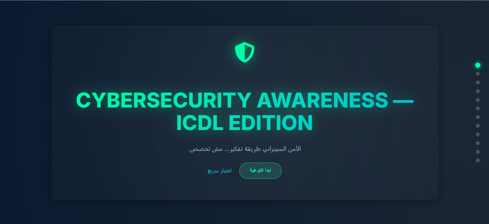

# 🛡️ ICDL Cyber

   



## 🌟 About the Project

**ICDL Cyber** is an interactive and engaging web experience designed to raise awareness about **Cybersecurity** basics! 🚀
It takes you on a journey through essential security concepts—like phishing, password safety, and safe browsing—presented in a fun, slide-based format. "Cybersecurity is a mindset... not just a specialization." 🧠🔒

## 📂 Project Structure

```
icdl-cyber/
├── 📄 index.html      # Main structure and content (Slides, Quiz, About)
├── 🎨 style.css       # Styling, animations, and responsive layout
└── 📜 script.js       # Logic for slides, quiz interaction, and navigation
```

## 🛠️ Technologies Used

- **HTML5**: Semantic structure.
- **CSS3**: Custom styling, Flexbox/Grid, and Animations.
- **Vanilla JavaScript**: Interactive slides and quiz logic.
- **FontAwesome**: Icons.
- **Google Fonts**: Typography.

## 🎯 Project Goal

To empower users with the fundamental knowledge to protect their digital lives, bridging the gap between technical jargon and everyday practical advice for ICDL students and graduates.

## 🚀 How to Run

1.  **Clone** or **Download** this repository.
2.  Open `index.html` in your favorite web browser.
3.  Enjoy the interactive slides! ✨

## 💡 Fun Tip

> "Passwords are like underwear: don't let people see it, change it very often, and you shouldn't share it with strangers." 😂

---

## 🎨 Creative & Fun

Hope you enjoy learning about cybersecurity as much as I enjoyed building this! Stay safe out there! 🛡️✨

---

# 💡 About & Contact

أنا **مصطفى عبد النعيم** — مؤسس **Code Journey**.  
أعمل على **تمكين الشباب من دخول عالم البرمجة بخطوات عملية وواضحة**، من خلال محتوى، تدريب، وتوجيه مبني على التجربة الفعلية.

## 🧭 Code Journey

> تمكين الشباب من دخول عالم البرمجة بخطوات عملية وواضحة.

في **Code Journey**، نؤمن أن التعلم الفعلي يبدأ لما تكتب كود بنفسك.  
هدفنا إننا نساعدك تبدأ رحلتك البرمجية بخطة منظمة، تطبيق واقعي، ودعم حقيقي من مجتمع بيساعد بعض.

## 📬 تقدر تتواصل معايا شخصيًا:

- 💬 واتساب: [اضغط هنا](https://wa.me/201114938410)
- 📧 الإيميل: [mnaeam10@gmail.com](mailto:mnaeam10@gmail.com)
- 🌐 [الموقع الرسمي](https://mostafa-naeam.vercel.app/)
- 💼 [LinkedIn](https://www.linkedin.com/in/mostafa-naeam/)

## 💬 تواصل معنا

- 💬 واتساب: [اضغط هنا](https://wa.me/201555303227)
- 📩 البريد الرسمي: [codejourney02@gmail.com](mailto:codejourney02@gmail.com)
- 💼 [LinkedIn – Code Journey](https://www.linkedin.com/company/code-journey25/)
- 🌐 [Website – mostafa-naeam](https://mostafa-naeam.vercel.app/)
